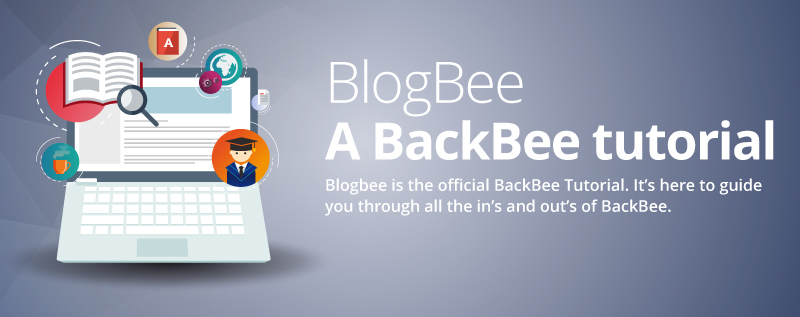

# Summary

-------------------------------------------------------------

* Day 1: [BackBee standard edition installation and first contribution](day1.md).
* Day 2: [Site conception and BackBee content management](day2.md)
* Day 3: [ContentType and template with render modes](day3.md)
* Day 4: [BackBee Edition mode](day4.md)
* Day 5: [Creating layouts](day5.md)
* Day 6: [Simple bundle creation (quote bundle)](day6.md)
* Day 7: Bundle administration (Disqus comment management inside bundle)
* Day 8: Email notification and User association: the event/listener system

